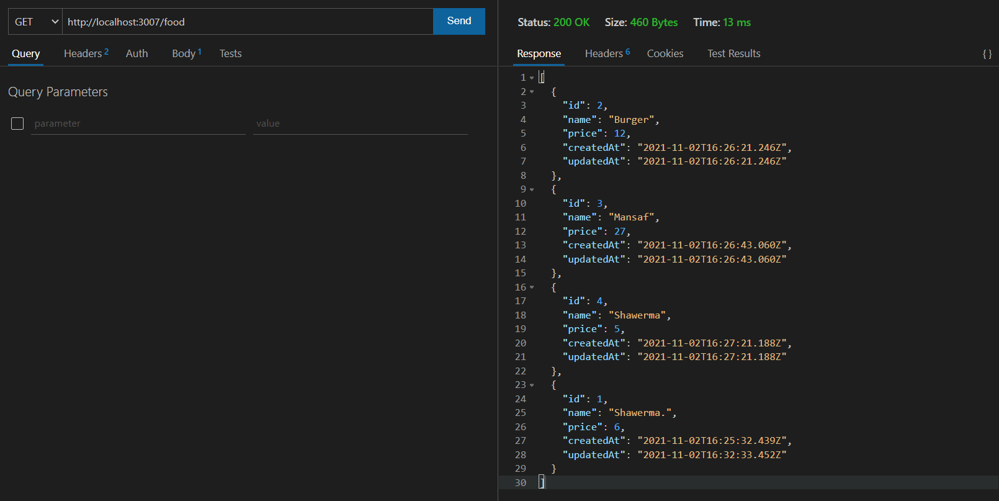
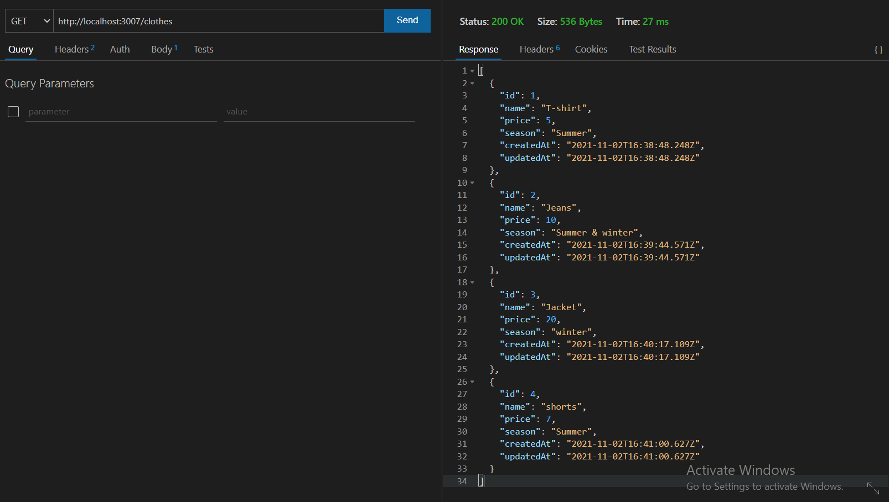
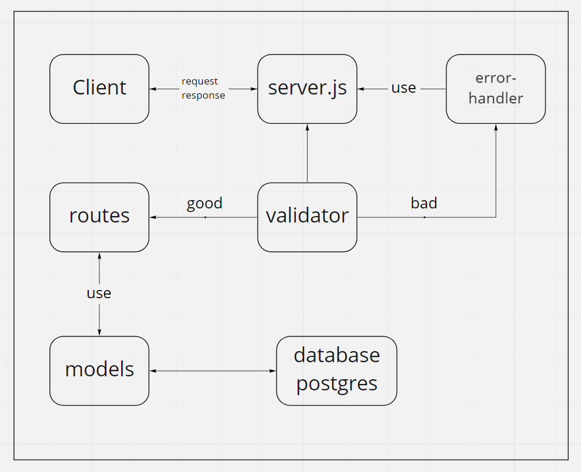

# basic-api-server

### Author : Nashat Alzaatreh

## install

1. copy the link of the repo
1. clone the repo on your local machine by `git clone repo-url`
1. download independencies by `npm i`
1. create a `.env`, then cope the content of `.env.sample` file inside the `.env` file.
1. fill the variables of `.env`
1. run the app

## Deploy, Run and Test

- [test report](https://github.com/NashatAlzaatreh/basic-api-server/actions)
- [deployed link](https://nashat-basic-api-server.herokuapp.com/)
- [Pull Request](https://github.com/NashatAlzaatreh/basic-api-server/pull/2)

### Setup

#### `.env` requirement

- `PORT` - port number

#### Running the app

- either:
  1. `npm start`
  1. `npm run dev` (nodemon)
- Endpoints: `/food`,

  - returns Object

    

- Endpoint: `/clothes`

  - returns Object

    

#### Test

- Unit test: `npm run test`

### UML:

